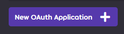
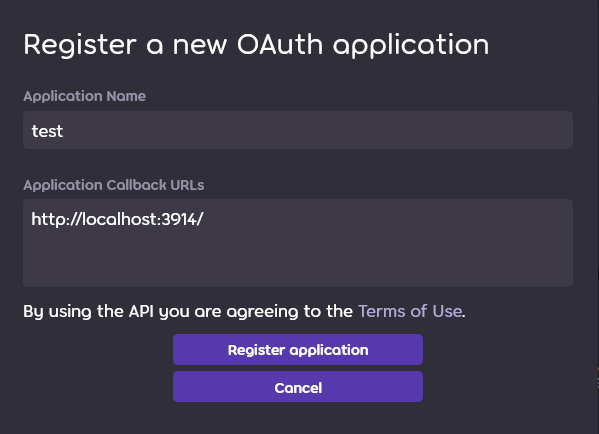
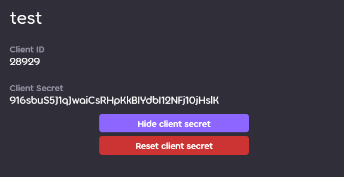

# THIS IS OUTDATED!!!


# Setup the bot
***
Here I will explain everything needed for the bot

## How to run
first clone the repository with:
```
git clone https://github.com/ibuergis/osuSwissBot.git
```

In the config folder there is config.sample.json. clone it and remove ".sample"

next Add in the values accordingly:
````json
{
  "botToken": "<The token from the bot youre using",
  "DBServer": "<The link to the database server>",
  "DBName": "<The name of the database>",
  "DBUser": "<The username for the database>",
  "DBPassword": "<The password for the database>",
  "clientId": "<The client ID you that you can get from osu!>",
  "clientSecret": "<The client secret connected to the client ID>",
  "checkRecentPlays": "<true or false | useful for testing>"
}
````

### To get the client ID and secret.
go to your osu! user and click on settings. Scroll down until you find oAuth.
Then click on this.



After that you can name your client after whatever you want.
The callback url though is currently hard-coded and its this:
```
http://localhost:3914/
```



After you registered you can see the clientId and the client secret.




### Install dependencies

Go to the folder where the project is in and open terminal.

If you just want to run it use:
```
    pip install .
```

If you want to help with development I recommend installing this too:

```
pip install osuSwissBot[tests]
```

This will also install pylama so that you can use the coding standard.

Lastly you can run it with:
```
    python main.py
```
